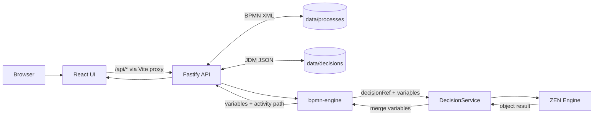

# Architecture

The first milestone implements Stack A from [BRIEF.md](../BRIEF.md): an npm-workspaces TypeScript app with a React/Vite frontend, a Fastify API, and an isolated ZEN decision package. The checked-in `order-discount` BPMN and JDM files provide a runnable example.

## Components and data

| Location | Implemented role |
| --- | --- |
| `apps/web/src` | React UI for selecting and saving BPMN/JDM models and running a process. `App.tsx` uses `React.lazy` and `Suspense` to load `ProcessEditor.tsx` (`bpmn-js`) and `DecisionEditor.tsx` (`@gorules/jdm-editor`) as separate editor chunks. The deferred JDM editor includes Monaco tooling. |
| `apps/api/src/app.ts` | Fastify routes, permissive development CORS, request checks, and error responses. |
| `apps/api/src/store.ts` | Reads and writes existing files under `apps/api/data/processes/*.bpmn` and `apps/api/data/decisions/*.json`. Model keys must start with a lowercase letter or digit and contain only lowercase letters, digits, or hyphens. There is no create or delete route. |
| `apps/api/src/process.ts` | Runs BPMN XML with `bpmn-engine`; records activity starts in an ordered path; bridges business rule tasks to `DecisionService`. |
| `apps/api/src/portable-decision.ts` | Checks the allowed JDM table subset before saving a decision. |
| `packages/decisions/src/index.ts` | Defines `DecisionService.evaluate(decisionKey, input)` and implements it with `@gorules/zen-engine`. This is the only package importing ZEN. It requires a non-array object result. |

The browser's API helper calls `/api/*`; Vite proxies that prefix to the API at `127.0.0.1:3001` and removes `/api`. The API itself exposes the unprefixed routes below. See `apps/web/vite.config.ts` and `apps/web/src/api.ts`.



## REST API

| Method and path | Success (`200`) | Validation / failure |
| --- | --- | --- |
| `GET /health` | `{ "ok": true }` | `500` on an unexpected server failure. |
| `GET /processes`, `GET /decisions` | Array of existing model keys. | `500` on a storage failure. |
| `GET /processes/:id` | `{ "xml": "…" }`. | `400` invalid key; `404` missing file; `500` unexpected read failure. |
| `PUT /processes/:id` | `{ "saved": true }`; body `{ "xml": "…" }`. The XML must parse as BPMN and contain a process. | `400` missing/invalid body or key, or invalid BPMN XML; `404` unknown key; `500` unexpected failure. |
| `POST /processes/:id/start` | `{ "variables": {…}, "path": [{ "id": "…", "name": "…" }] }`; body `{ "variables": {…} }`. | `400` missing/non-object variables or invalid process key; `404` missing process file; `500` execution/evaluation failure. |
| `GET /decisions/:id` | Parsed JDM JSON. | `400` invalid key; `404` missing file; `500` invalid stored JSON or unexpected failure. |
| `PUT /decisions/:id` | `{ "saved": true }`; body is the JDM JSON object. | `400` missing/invalid JSON, invalid key, or portability-guard rejection; `404` unknown key; `500` unexpected failure. |

All responses use Fastify's default `200` for these successful handlers. `ClientError` maps known input and missing-file failures to `400`/`404` with `{ "error": "…" }`; Fastify parser errors also become `4xx`. Other errors are masked as `500 { "error": "Internal server error" }`. The PUT routes overwrite **existing** files only. See `apps/api/src/app.ts`, `errors.ts`, and `store.ts`.

## Business rule task execution

The saved example has Start → **Determine discount** → exclusive gateway → **Apply discount** or **No discount** → End. Its business rule task has `camunda:decisionRef="order-discount"` and `implementation="${environment.services.evaluateDecision}"`. `process.ts` loads `camunda-bpmn-moddle`, so `bpmn-engine` exposes `decisionRef` on the task behavior. The registered `evaluateDecision` service reads `this.behaviour.decisionRef`, calls `decisions.evaluate(key, finalVariables)`, and merges the returned object into both engine variables and final variables. `ZenDecisionService` loads `data/decisions/<key>.json`, creates a ZEN decision, and evaluates it. The gateway then follows its configured condition; the example's apply branch computes `discountedTotal`. An `activity.start` listener records the traversed elements except the process container. See `apps/api/src/process.ts`, `packages/decisions/src/index.ts`, and the checked-in example BPMN.

## Server-side portability guard

`PUT /decisions/:id` calls `validatePortableDecision` **before** writing. It requires at least one decision-table node; permits only input, output, and decision-table node types; requires table input/output/rule arrays, `hitPolicy: "first"`, simple dotted field paths, simple comparison/literal/list or inclusive numeric-range input cells, and literal output cells. An empty input cell is allowed as a wildcard. Rejections return `400` with the guard's message. See `apps/api/src/portable-decision.ts` and [DMN portability guidance](dmn-portability.md).

The current guard checks table content, not the complete graph topology or FEEL equivalence, and it runs on **save**, not when an existing file is loaded for execution. A future DMN exporter still needs structural validation and side-by-side decision tests.

## Folder layout

```text
bpmn-dmn-app/
├── README.md                 # setup and commands
├── BRIEF.md                  # original milestone specification
├── apps/
│   ├── web/                  # React/Vite UI and two lazy editor modules
│   └── api/
│       ├── src/              # routes, process runner, storage, guard, tests
│       └── data/
│           ├── processes/    # order-discount.bpmn
│           └── decisions/    # order-discount.json
├── packages/
│   └── decisions/            # DecisionService, ZEN adapter, tests
└── docs/
    ├── architecture.md
    ├── dmn-portability.md
    └── adr/0001-stack-a-zen-bpmn-engine.md
```
