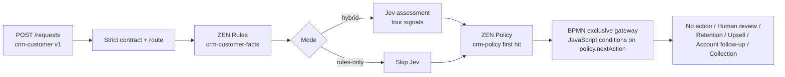

# Hybrid decisions: CRM next best action

**Status:** Implemented in Milestone 3. See the [Milestone 3 brief](../BRIEF.md) and the [CRM policy table](../apps/api/data/decisions/crm-policy.json).

Rules answer **what do we know?** Jev answers **what appears to be true?** Policy answers **what are we allowed to do?** BPMN answers **what happens next?** Jev supplies signals, never actions. [Brief](../BRIEF.md)

The `crm-customer` v1 contract has `mode`, customer/sales/payments/activity fields, and up to ten notes. `route-crm-customer` selects `crm-next-best-action`. Four fact tables derive `strategicAccount`, `salesDeclining`, `visitOverdue`, and `paymentProblem`; the policy then chooses an action; BPMN's `recordCrmAction` service records human review, retention, upsell, account, or collection follow-up. No action takes the gateway's default path. The order-discount, order, and loan flows remain deterministic-only. [CRM contract](../apps/api/data/contracts/crm-customer/v1.json), [facts table](../apps/api/data/decisions/crm-customer-facts.json), [BPMN process](../apps/api/data/processes/crm-next-best-action.bpmn)

## Run the showcase

Run `npm run dev`, open <http://127.0.0.1:5173>, and select **CRM showcase** in the top navigation. Pick one of the five scenarios, select **Rules only** or **Rules + Jev**, and click **Run**. **Compare** sends both modes concurrently and displays their facts, signals, policy rules, and final actions side by side. Notes can be edited or reset; the four panels show customer state, business rules, Jev assessment, and the decision trace. [CRM UI](../apps/web/src/CrmShowcase.tsx)

## Four Jev questions

One request sends the customer payload, excluding `mode`, as shared state. Question IDs are identifiers, not model instructions; each instruction must state its full meaning. Thresholds belong only in the policy table. [Questions](../packages/decisions/src/jev/crm-questions.ts), [TypeSafe API reference](https://docs.typesafe.ai/api)

| ID | Jev type | Signal |
| --- | --- | --- |
| `needs_commercial_attention` | `noul` | Whether proactive commercial attention is warranted; value 0–1, without a confidence field. |
| `switching_risk` | `noul` | Evidence that the customer may switch suppliers; value 0–1. |
| `commercial_objective` | `choice` | `RETENTION`, `UPSELL`, `COLLECTION`, `NORMAL_FOLLOWUP`, or `OTHER`; include probability and confidence. |
| `relationship_risk` | `score` | Four described levels: `LOW`, `MEDIUM`, `HIGH`, `CRITICAL`; map score to nearest level and retain confidence. |

## Policy: ordered first hit

All rows are in one portable ZEN first-hit table. The first matching row writes both `policy.nextAction` and `policy.rule`. Earlier hard rules take precedence over Jev availability. [CRM policy table](../apps/api/data/decisions/crm-policy.json), [TypeSafe confidence guidance](https://docs.typesafe.ai/confidence)

| # | Condition | `nextAction` | `rule` |
| --- | --- | --- | --- |
| 1 | `paymentProblem` | `COLLECTION_FOLLOWUP` | `PAYMENT_DELINQUENCY` |
| 2 | `active = false` | `NO_ACTION` | `INACTIVE_ACCOUNT` |
| 3 | Rules-only, strategic, sales declining | `HUMAN_REVIEW` | `RULES_ONLY_RISK_UNCLEAR` |
| 4 | Rules-only | `NO_ACTION` | `RULES_ONLY_NO_SIGNAL` |
| 5 | `jev.status = unavailable` | `HUMAN_REVIEW` | `JEV_UNAVAILABLE` |
| 6 | Strategic, switching risk ≥ 0.8, attention ≥ 0.85 | `CREATE_RETENTION_VISIT` | `RETENTION_STRATEGIC_ACCOUNT` |
| 7 | Switching risk ≥ 0.4 | `HUMAN_REVIEW` | `AMBIGUOUS_SWITCHING_RISK` |
| 8 | Objective `UPSELL`, probability ≥ 0.8, confidence ≥ 0.5 | `CREATE_UPSELL_FOLLOWUP` | `UPSELL_CONFIDENT` |
| 9 | Strategic account and sales declining | `CREATE_ACCOUNT_FOLLOWUP` | `STRATEGIC_DECLINE_FOLLOWUP` |
| 10 | Attention < 0.5 | `NO_ACTION` | `NO_ATTENTION_NEEDED` |
| 11 | Otherwise | `HUMAN_REVIEW` | `NO_POLICY_MATCH` |

Row 9 sets a deterministic floor: a strategic account with declining sales receives an account follow-up even if Jev sees no semantic risk. Jev can raise the response through an earlier retention or review row, but its low-attention signal cannot reduce that case to `NO_ACTION`. The BPMN exclusive gateway uses JavaScript `conditionExpression` scripts comparing `environment.variables.policy.nextAction` to the five non-default actions; its default flow is no action. No Jev answer directly enters that gateway. [BPMN process](../apps/api/data/processes/crm-next-best-action.bpmn)

## Fixture outcomes in mock mode

These are expected outcomes for the five bundled fixtures with `JEV_MODE=mock`. Rules-only skips Jev; hybrid uses canned answers keyed by `customer.id`. Only Andes Retail has both strategic-account and declining-sales facts; it already matches an earlier rule in each mode, so the new account-follow-up row changes none of these outcomes. Live Jev results can differ from mock. [Fixtures](../apps/api/data/fixtures/crm-customer.json), [mock answers](../packages/decisions/src/jev/mock.ts), [policy table](../apps/api/data/decisions/crm-policy.json)

| Scenario | Rules only | Rules + Jev (mock) |
| --- | --- | --- |
| Healthy account | `NO_ACTION` | `NO_ACTION` |
| Andes Retail switching risk | `HUMAN_REVIEW` (`RULES_ONLY_RISK_UNCLEAR`) | `CREATE_RETENTION_VISIT` |
| Upsell opportunity | `NO_ACTION` | `CREATE_UPSELL_FOLLOWUP` |
| Payment issue | `COLLECTION_FOLLOWUP` | `COLLECTION_FOLLOWUP` |
| Ambiguous signals | `NO_ACTION` | `HUMAN_REVIEW` (`AMBIGUOUS_SWITCHING_RISK`) |

## Availability, mock, and live operation

Copy `.env.example` to `.env`. For a keyless demo set `JEV_MODE=mock`: canned answers are selected by fixture customer ID, labeled `source: "mock"`, and shown with a **MOCK** badge. Mock answers ignore edited notes; use live mode to assess the edited state. For live mode set `JEV_MODE=live` and `JEV_API_KEY=<your-key>` locally. Rules-only sets Jev assessment to `skipped` and needs no key. [Example environment](../.env.example), [assessor](../packages/decisions/src/jev/index.ts), [CRM UI](../apps/web/src/CrmShowcase.tsx)

Live mode calls `POST /v1/systemone` with a pinned default model `jev-1.13.0` (overridable with `JEV_MODEL`), an 8-second timeout, and one retry for 429/529, honoring `retry-after` for at most 2 seconds. Missing key or failed assessment becomes `unavailable`, never a silent mock. For an active customer without a payment problem, that matches `JEV_UNAVAILABLE` and routes to `HUMAN_REVIEW`; payment and inactive-account rules take precedence. `npm test` does not call live Jev. `npm run test:live` checks a live Andes Retail answer shape when a key is set and skips without one. [HTTP client](../packages/decisions/src/jev/client.ts), [live test](../packages/decisions/src/jev/live.test.ts), [TypeSafe models](https://docs.typesafe.ai/models), [TypeSafe API reference](https://docs.typesafe.ai/api)

## Trace and logging

The returned `variables.trace` contains `ZEN` (facts), `JEV` (assessment), `ZEN` (policy), and `BPMN` (path) entries, in that order. The UI labels the second ZEN entry **POLICY** and shows the matching rule and final action. One structured server log line per CRM run records request ID (for typed requests), response model, four question IDs, mapped answer values, objective probability, objective/relationship confidence, elapsed time, `policyRule`, `nextAction`, and BPMN activity IDs. It does **not** include customer state, notes text, the API key, or the Authorization header. [services](../apps/api/src/services/index.ts), [process logging](../apps/api/src/process.ts), [CRM UI](../apps/web/src/CrmShowcase.tsx)

See [ADR 0003](adr/0003-hybrid-decisions-jev.md) for the decision rationale and [DMN portability](dmn-portability.md) for table constraints.
