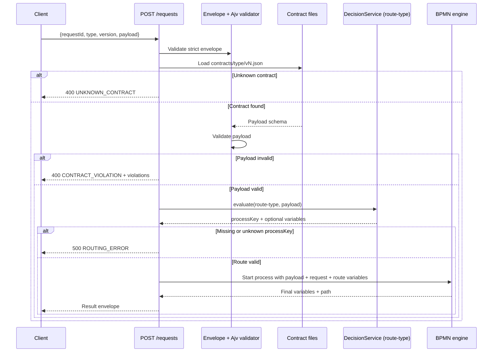

# Typed request contracts (Milestone 2)

This describes the Milestone 2 contract in [BRIEF.md](../BRIEF.md). Implementation is in progress; the API shapes below are the agreed behavior, not a claim that every route is already available.

## Envelope and registry

Clients send one strict JSON envelope to `POST /requests`:

```json
{
  "requestId": "req-123",
  "type": "order",
  "version": 1,
  "payload": { "customerTier": "gold", "orderTotal": 150, "country": "BO" }
}
```

The envelope has exactly four fields (`additionalProperties: false`). `requestId` is a non-empty string and is echoed in the response. `type` matches `^[a-z0-9][a-z0-9-]*$`; `version` is an integer at least 1; `payload` is an object. The `type` and `version` pair selects `apps/api/data/contracts/<type>/v<version>.json`, which is the JSON Schema for **payload only**. The brief permits JSON Schema draft 2020-12 or draft-07; choose and declare a dialect in each schema. [Brief](../BRIEF.md), [JSON Schema dialects](https://json-schema.org/understanding-json-schema/reference/schema)

The registry also holds `apps/api/data/decisions/route-<type>.json`, a first-hit JDM routing table whose input is payload fields and whose output includes `processKey`. The selected BPMN lives at `apps/api/data/processes/<processKey>.bpmn`. A route may return extra variables, which are merged into process variables. Each process can still invoke ordinary decisions through business rule tasks. See [BRIEF.md](../BRIEF.md) and [JDM format](https://docs.gorules.io/developers/jdm/standard).

## Request lifecycle

1. Validate the envelope shape and fields.
2. Resolve `(type, version)` to its contract. An unknown pair is `400 UNKNOWN_CONTRACT`.
3. Validate `payload` against the selected strict JSON Schema. Return all useful violations as `{ path, message }` entries in a `400 CONTRACT_VIOLATION` response.
4. Evaluate `route-<type>` with the validated payload. Require a `processKey` that names an existing process. A missing or unknown key is `500 ROUTING_ERROR`.
5. Start that process with the validated payload plus `request: { requestId, type, version }` and any extra routing variables. Return `{ requestId, type, version, processKey, variables, path }`, where `path` is the executed activity path. [Brief](../BRIEF.md)



## Errors and read routes

| HTTP | Code | Meaning / response detail |
| --- | --- | --- |
| `400` | `UNKNOWN_CONTRACT` | No contract file exists for the requested `type` and `version`. |
| `400` | `CONTRACT_VIOLATION` | Payload fails its contract; include a violation list of `{ path, message }`. The brief does not assign a named code to malformed envelopes. |
| `500` | `ROUTING_ERROR` | The routing decision produces no `processKey` or refers to an unavailable process. This is a server-side model/configuration fault. |

The additional `GET /contracts` and `GET /contracts/:type/:version` routes expose the registry read-only. [BRIEF.md](../BRIEF.md)

## Writing strict contracts

- Set `type: "object"` and `additionalProperties: false` on the payload object and on nested objects that must also be closed. JSON Schema allows undeclared properties by default. [JSON Schema object reference](https://json-schema.org/understanding-json-schema/reference/object)
- Declare each field in `properties`, put mandatory fields in `required`, and state types explicitly. A field in `properties` is optional unless listed in `required`. [JSON Schema object reference](https://json-schema.org/understanding-json-schema/reference/object)
- Use `enum` for closed choices, such as customer tier or loan term; use `minimum`/`maximum` or `exclusiveMinimum`/`exclusiveMaximum` for numeric bounds; use `minLength`, `maxLength`, and `pattern` where strings need limits. [JSON Schema validation reference](https://json-schema.org/understanding-json-schema/reference)
- Write positive and negative examples at boundaries: missing required fields, extra properties, wrong types, each enum alternative, and values just inside/outside numeric limits. The planned `order` and `loan-application` examples in the brief are placeholders until real contracts are supplied. [BRIEF.md](../BRIEF.md)

Published versions are immutable: a changed contract gets a **new `v<version>.json` file**, never an edit to the published file. Keep older versions available so existing clients can still submit their declared version. [BRIEF.md](../BRIEF.md)

## Adding a new request type

1. **Contract file:** choose a type key and create `apps/api/data/contracts/<type>/v1.json` with a declared JSON Schema dialect, strict fields, and representative valid/invalid examples.
2. **Route decision:** create `apps/api/data/decisions/route-<type>.json` as a portable first-hit table. Cover every valid payload with a `processKey`; use only simple comparisons/literals per the [portability guide](dmn-portability.md).
3. **Processes:** add each referenced `apps/api/data/processes/<processKey>.bpmn`; ensure its ID/key matches the route output and any business rule task references an available decision.
4. **Service handlers:** add required handlers to `apps/api/src/services/`, and reference them from BPMN as `${environment.services.<name>}`. Keep service logic out of the routing table.
5. **Tests:** cover envelope rejection, unknown type/version, contract violations, each routing branch, missing/unknown route keys, and successful end-to-end process paths. For a later schema change, add `v2.json` and retain `v1.json`. [BRIEF.md](../BRIEF.md)
